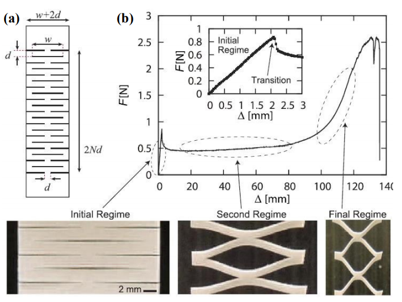

# Literature review

## Creep and Crimp of fiber
https://textilestudycenter.com/creep-and-crimp-of-fiber/

## A kirigami approach to engineering elasticity in nanocomposites through patterned defects : DOI: 10.1038/NMAT4327

Highlights:

- With a single cut in the middle of the sample, the stress–strain curve shows a slight decrease of ultimate strength but otherwise behaves similarly to the pristine paper (dashed blue). In contrast, a sheet of the same paper with the tessellated kirigami cuts (green) shows markedly different tensile behaviour. The initial elasticity at <5% strain closely follows the deformation curve of the pristine sheet. As the applied tensile force exceeds a critical buckling force, the initially planar sheet starts to deform as the thin struts formed by the cuts open up. Within a secondary elastic plateau regime, buckling occurs at the struts as they rotate to align with the applied load, and deformation occurs out of
the plane of the sample. During the deformation process, kirigami patterned sheets exhibit out-of-plane deflection due to mechanical bistability. This out-of-plane deflection can be used to impart additional functionality, as we demonstrate in the later part of the present study. Finally, the alignment of the struts causes the overall structure to densify perpendicular to the pulling direction.

## Stress-strain behavior in stretchable electronics

Highlights:

Many biological tissues, such as skin, ligaments, etc., exhibit ‘J-shaped’ stress–strain behaviors as a result of their curved and chained microstructures.
To enable natural, comfortable integration of stretchable electronics with biological tissues/organs, an important design consideration is to reduce the stresses induced on
the skin by the presence of the devices to within thresholds for somatosensory perception. Specifically, the electronics must be sufficiently compliant to accommodate deformations of soft biological tissues typically within several to tens of percent. Materials with ‘J-shaped’ stress-strain behavior are well-matched to this requirement due to their low elastic modulus at small strains.

## Tunable Mechanical Metamaterials through Hybrid Kirigami Structures

## My understanding so far ...

I should consider my experiment from the point of view of the meso material. If I start comparing my fabric samples to a plain fabric or even to fiber, I would not have same order of magnitude and i wont be looking at the same phenomenons. Here I will consider that I am doing my experience on the same fabric with the same overall tensile behaviorm regardless of where in the fabric i have cutted the samples, how i have cutted them. I am considering that the "plain" ( before the kiragami cuts and the platic infused) sample
all ahve the same tensile behavior. However i will have to make this hypothesis annd wont be able to prove it as my DIY tensile tester does not allow to pull very strong forces.
I will focus on the tensile behavior of the samples for range of forces much lower: the forces for which my "modified" samples will extend, up to the point of plasti deformation  and/or breakage of the fabric.
There will be the deteroration of the weave, then breakage of the sample at the points of higher stress.
There will be the plastic deformation of the infused PLA that is infused on the fabric, then its breakage of the point of higher stess.
These 2 behavior will probably overlapp and interfer with each other, make the whole behavior hard to read. But i will try to isolate the different phases.

The added value of infusing PLA: add rigidity to the structure. 

